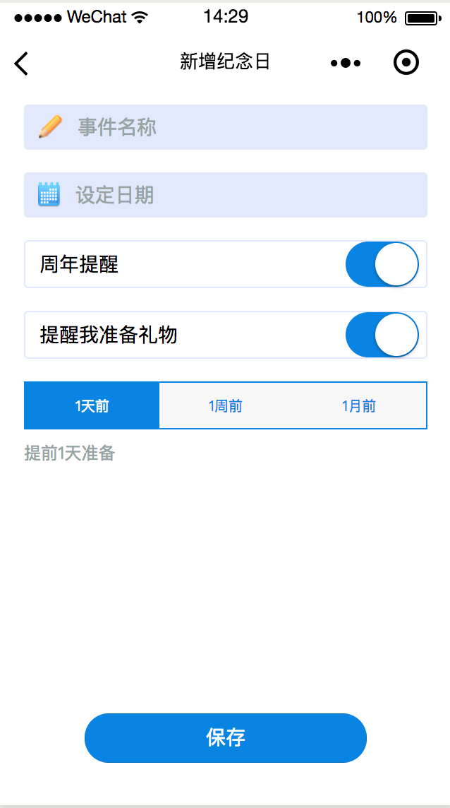

# iBu
Wx Mini App

[微信小程序开发](https://mp.weixin.qq.com/debug/wxadoc/dev/)

### 功能
---
为了学习小程序开发, 做的一个 demo 程序, 主要用到的 feature 有:

* WXSS flex 布局
* wx.API ~> Storage, Navigate
* 自定义 Components
* 内置组件 button text picker switch scroll-view image

主要是实现了增、删、改、查纪念日的功能 (对，其实这个 app 是为女票写的 🤪

---
### 截图

### TODO

* 提醒功能 (目前貌似小程序不能向用户主动推消息，只有一种模板消息，还有时限)

* 详情页 可以上传添加相关图片 类似跑马灯的效果

